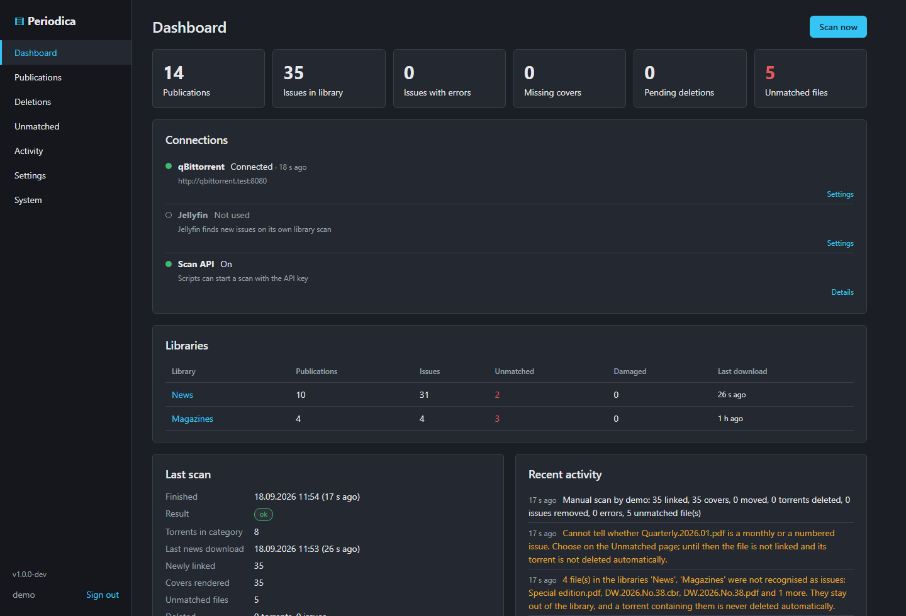
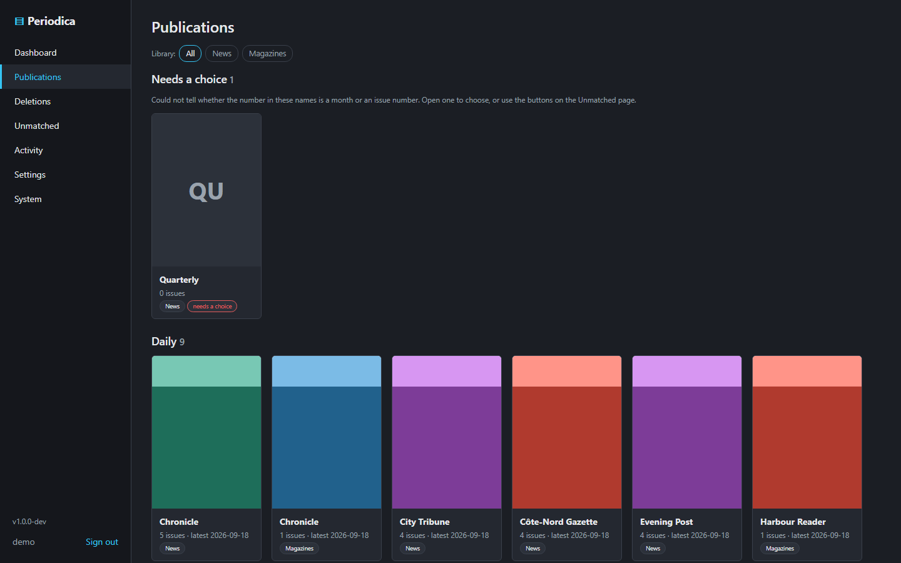
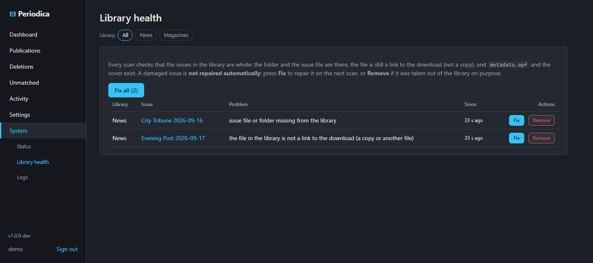

# Periodica

Self-hosted helper that turns downloaded newspapers, magazines and comics into a tidy **Jellyfin Books
library**. It watches a qBittorrent category (or just a folder), hardlinks each issue into its own folder,
writes local metadata and a cover, and asks Jellyfin to refresh. Optionally it deletes old issues and their
downloads after N days.

> **Written by AI.** This project was designed and implemented by Claude (Anthropic), directed and tested by a
> human maintainer on a real qBittorrent + Jellyfin setup. It has automated tests, security checks and
> end-to-end tests against real services, but read the code before you run it, as with any self-hosted tool.



## What it does

- **Hardlinks** each issue file — PDF, CBZ, CBR or EPUB — into a clean folder per issue, so no extra disk space
  is used and seeding continues.
- **Names issues properly**: daily, monthly and numbered issues, with your own naming patterns for the ones no
  rule reads.
- Writes **local metadata** (`metadata.opf`) and a **cover** (a PDF's first page, or the cover image inside a
  CBZ or EPUB). Nothing is fetched from the internet.
- **Several libraries**, each with its own category, folders, Jellyfin library and rules.
- **Watches over the library**: every scan checks that linked issues are still whole, and reports what isn't.
- **Deletes old issues automatically** if you ask it to, with a preview, an arming step and a grace period.
- **Web UI** in the style of Sonarr and Radarr: settings, publications, issues, deletions, activity and logs.

LAN-only by design: it talks to your qBittorrent and Jellyfin and nothing else. qBittorrent and Jellyfin are
both optional, and an offline mode switches off every outgoing connection.

```
/srv/data/torrents/books/news/                    (qBittorrent, category "news")
  Daily Newspapers 15 09 2026/
    Evening.Post.2026.09.15/Evening.Post.2026.09.15.pdf

/srv/data/media/books/news/                       (Jellyfin Books library)
  Evening Post/
    folder.jpg                                      newest front page
    Evening Post 2026-09-15/
      Evening Post 2026-09-15.pdf                   hardlink
      metadata.opf                                  title "Evening Post 2026-09-15"
      cover.jpg                                     page 1
```

## Quick start

1. Create a category in qBittorrent, e.g. `news`, and note the user qBittorrent runs as.
2. Deploy [`docker-compose.yml`](docker-compose.yml) with `PUID`/`PGID`, `DATA_PATH` (one folder holding both
   `torrents/` and `media/`, so hardlinks work) and `CONFIG_PATH`.
3. Open `http://<server-ip>:8765`, create the admin account, and fill in the qBittorrent connection and the
   category under **Settings**.
4. Create a **Books** library in Jellyfin for the destination folder and paste a Jellyfin API key into
   **Settings → Jellyfin**.
5. Add a torrent to the category and press **Scan now**.

Step by step, with the RSS rule, the finished-download trigger and automatic delete:
**[docs/setup.md](docs/setup.md)**.

## Documentation

| | |
|---|---|
| [Setup](docs/setup.md) | install, automations, libraries, running without qBittorrent or Jellyfin, offline mode, updates |
| [Names and formats](docs/naming.md) | which files are linked, formats and priority, naming patterns, library health |
| [Jellyfin](docs/jellyfin-setup.md) | library type, metadata providers, what Jellyfin reads |
| [Troubleshooting](docs/troubleshooting.md) | connections, the scan call, Jellyfin quirks, logs |
| [Development](docs/development.md) | running from source, checks, tests, the module map |
| [Security](SECURITY.md) | the threat model and what protects against what |
| [Changelog](CHANGELOG.md) | releases |

## Screenshots

| Publications | Library health |
|---|---|
|  |  |

## Safety in one paragraph

The only downloads Periodica can see or touch are the ones in the qBittorrent category you choose. It checks
that category again on its own side for every response, and once more immediately before any delete. It never
writes into the downloads folder: files are removed only by asking qBittorrent to delete a torrent. In the
library it deletes only folders carrying its own marker file. Automatic delete is **off** by default; turning
it on needs a dry-run preview and an explicit *arm*, expired items then wait in a queue for a grace period, and
if more fall due at once than the safety limit allows, nothing runs until you approve. Details and the full
threat table: [SECURITY.md](SECURITY.md).

## Licence

[GPL-3.0-or-later](LICENSE). Copyright (C) 2026 KorppuJauho.
